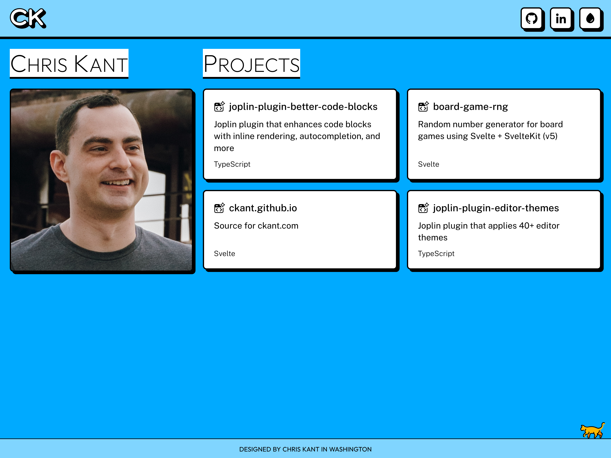

<h1 align="center">
   
  ckant.com
   
</h1>

<h4 align="center">Source code for https://ckant.com</h4>

  

  <a href="#credits">Credits</a> •
  <a href="#license">License</a>

## Credits
- [Neobrutalism components](https://www.neobrutalism.dev) for neobrutalist theme inspiration
- Fonts:
  - [Outfit](https://github.com/Outfitio/Outfit-Fonts) for the heading font
  - [Public Sans](https://public-sans.digital.gov) for the text font
- Icons:
  - [Octicons](https://primer.style/octicons) for the github logo
  - [Akar Icons](https://akaricons.com) for the linkedin logo
  - [Phosphor Icons](https://phosphoricons.com) for the droplet icon
  - [OpenMoji](https://openmoji.org/) for the cat emoji
- [GoatCounter](https://www.goatcounter.com/) for page visit counts
- [Svelte](https://svelte.dev) for the fun web framework

## License

Copyright © 2025 [Chris Kant](https://github.com/ckant). 
This project is [MIT](https://github.com/ckant/ckant.github.io/blob/main/LICENSE) licensed.
